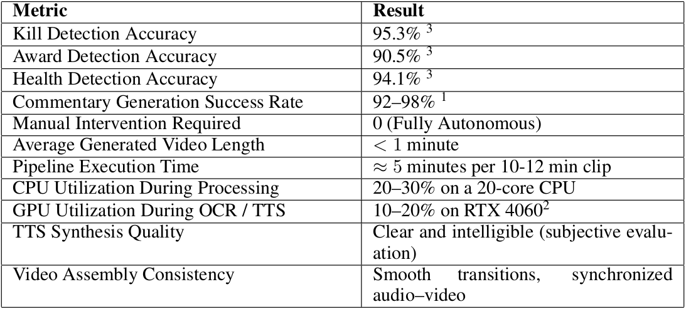
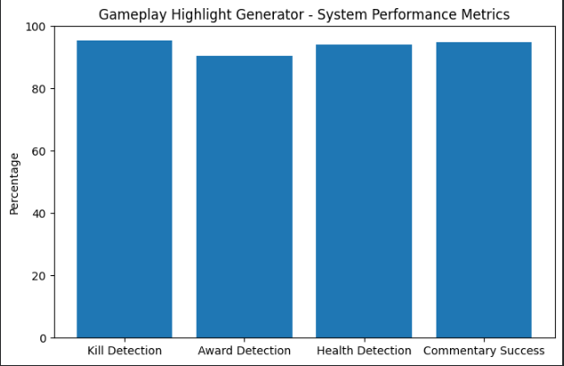
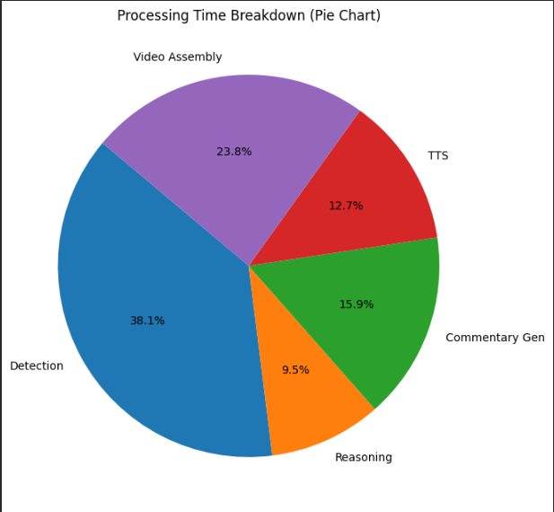
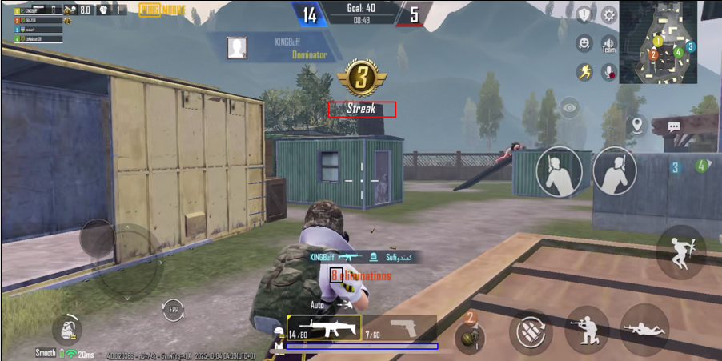

# Gameplay Highlight Generator

An AI-powered system that automatically detects, extracts, and compiles the most exciting moments from gameplay footage.
The pipeline includes ROI-based HUD parsing, kill/award/health detection, rule-based event filtering, and automated highlight reel generation with optional commentary.

# Folder Structure

```
.
├── assets/                 # Static assets (icons, images, etc.)
├── generated_voice/        # Auto-generated TTS audio files  
├── rois/                   # ROI configuration files for HUD detection
├── runs/                   # Logs / run artifacts
├── saved/                  # Saved YAMLs and intermediate outputs
│   └── gameplay_commentary.yaml
├── src/
│   ├── helpers/            # Utility/helper modules
│   └── processing/
│       ├── awards.py               # Award detection module
│       ├── caption_gen.py          # TTS Module
│       ├── caption_generator.py    # Caption generation logic
│       ├── editing_module.py       # Video editing + audio mixing
│       ├── health_bar.py           # Low-health detection module
│       ├── ocr.py                  # Deep OCR pipeline for kill
│       ├── processing_thread.py    # Main pipeline controller
│       ├── roi_cropper.py          # Extract ROIs and HUD regions
│       ├── rules.py                # Rule-based event filtering
│       ├── ui.py                   # UI logic
│       └── __init__.py
├── tests/                  # Sample scripts for testing each module
│   ├── test_ocr.py
│   ├── test_awards.py
│   ├── test_health.py
│   ├── test_rules.py
│   ├── test_editing.py
│   └── main.py             # Entry point to run the full pipeline
├── vids/                   # Input gameplay videos
├── environment.yml         # Conda environment specification
├── highlights_output.mp4   # Sample generated highlight video
├── LICENSE
├── README.md
└── requirements.txt        # Pip dependencies

```

## Features

### **HUD-Aware ROI Processing**
Detects kills, awards, and player health through predefined Regions of Interest on the game HUD.

### **Deep OCR Kill Counter Extraction**
Robust OCR pipeline capable of handling motion blur, low contrast, and rapid gameplay movement.

### **Rule-Based Highlight Logic**
Filters raw detections and produces meaningful highlight events such as:
- **Kills at low health**
- **Kill streaks**
- **Award moments**
- **Clutch plays**

### **Automated Reel Generation**
For every detected highlight, the pipeline:
- Extracts surrounding context frames
- Generates optional AI commentary (TTS)
- Merges video and audio
- Produces a polished highlight reel

### **Modular Codebase**
Each subsystem can be run and tested individually using scripts in the `tests/` folder.


## Installation

```bash
conda env create -f environment.yml
conda activate gameplay-highlights
pip install -r requirements.txt
```


## Running Tests

The `tests/` folder contains multiple scripts that allow you to run and validate individual modules.

Example usage:

```bash
PYTHONPATH=src python -m tests.test_ocr
PYTHONPATH=src python -m tests.test_rules
```

### **Running the Full Pipeline**

Use the main script located inside tests/main.py:
```bash
PYTHONPATH=src python -m tests.main
```
## Results






